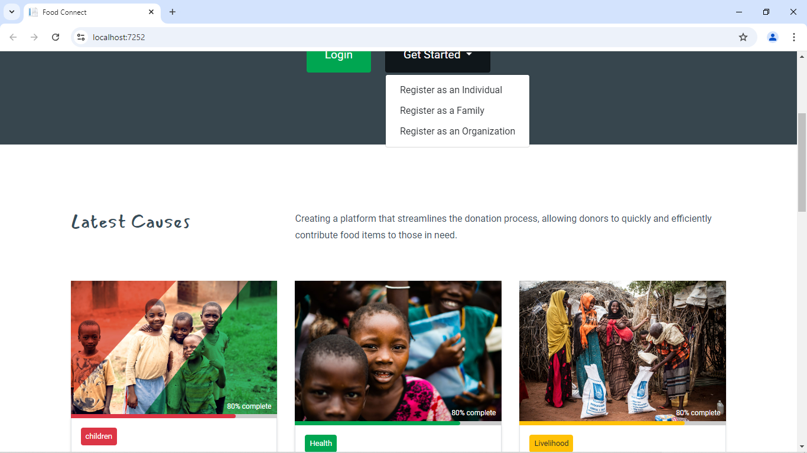
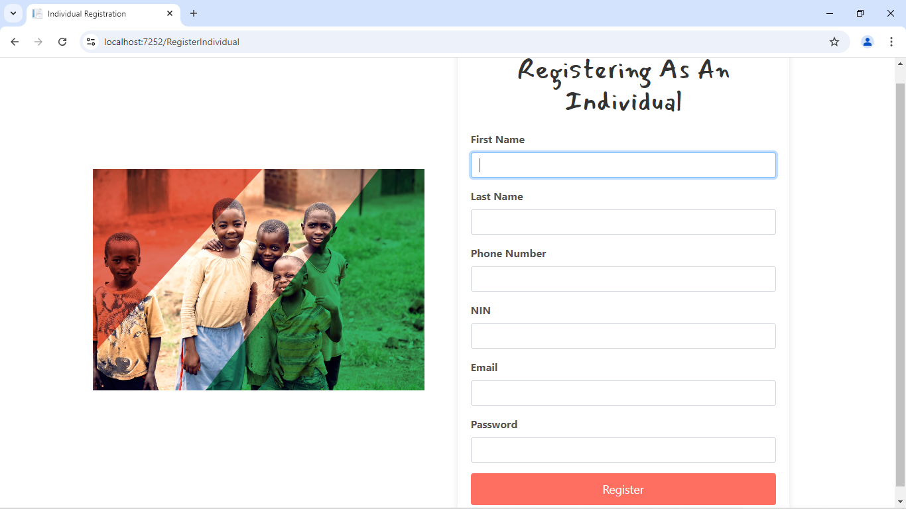
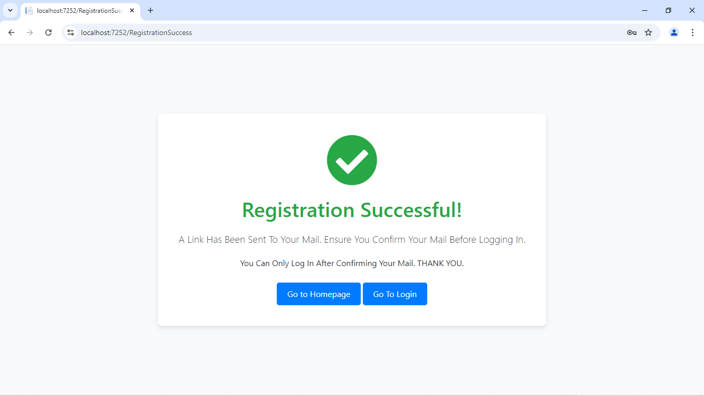
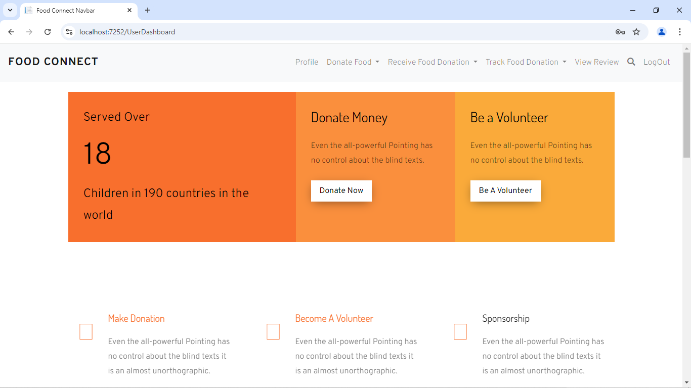
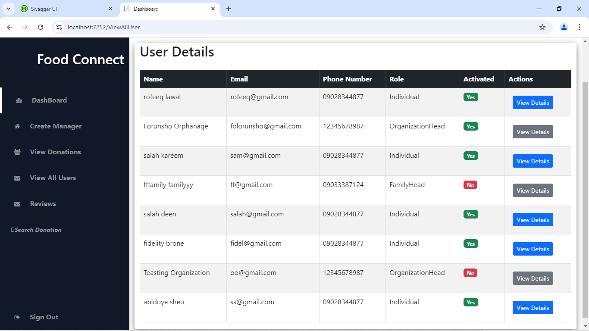
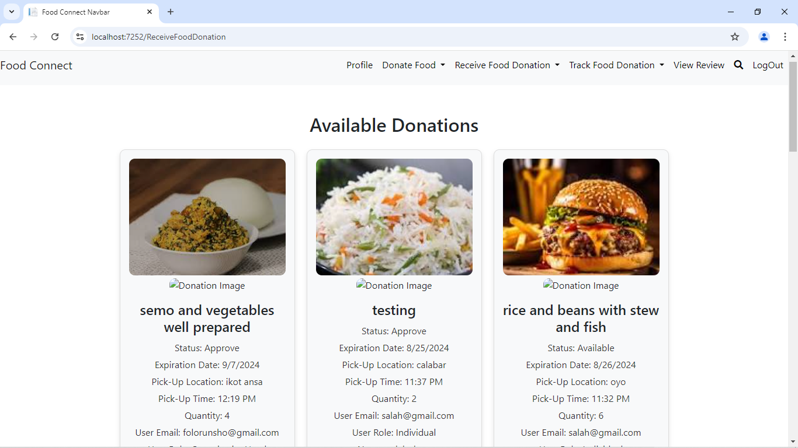
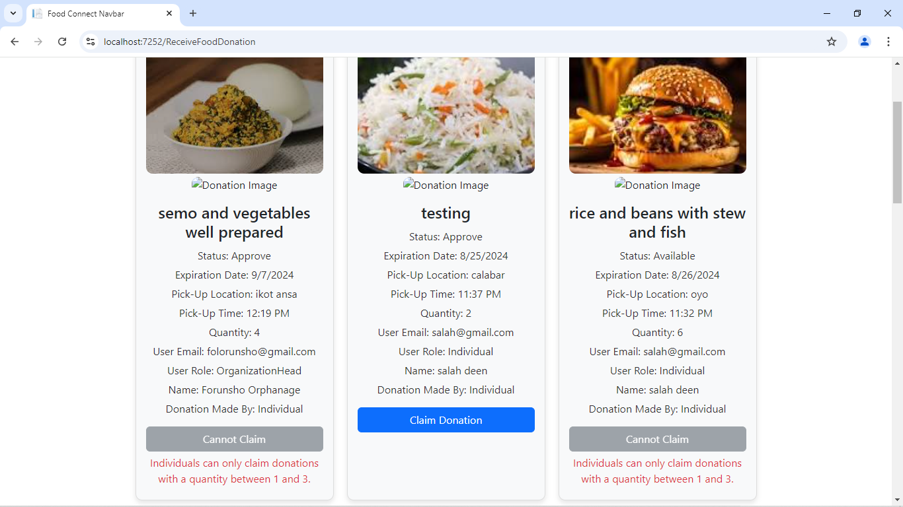
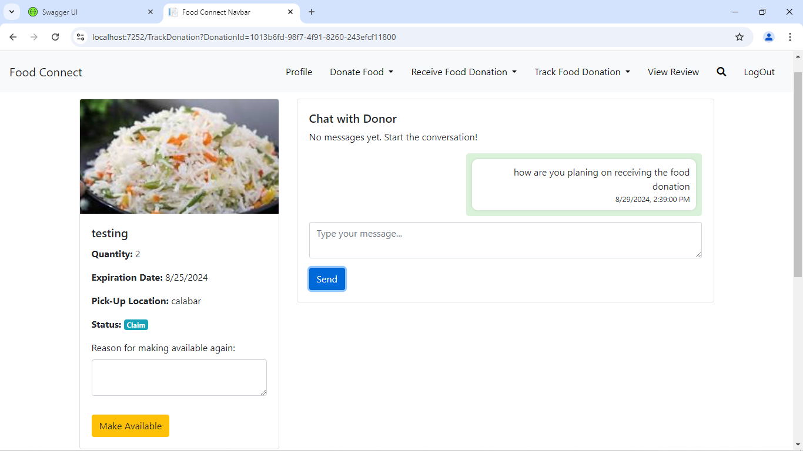
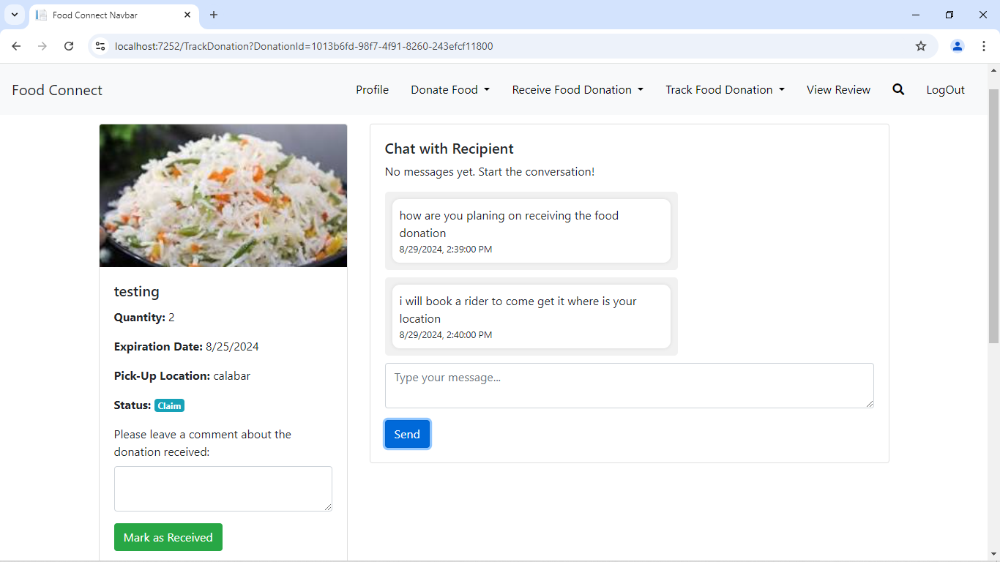
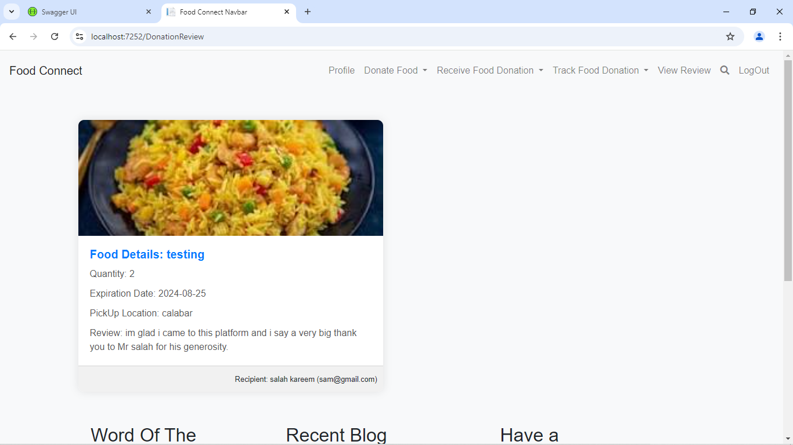

# Food Connect

Welcome to **Food Connect**, a platform designed to bridge the gap between surplus food sources and those in need. Our mission is to reduce food waste and combat food insecurity by connecting individuals, families, organizations, restaurants, supermarkets, and other food suppliers with those in need of food, charities and food distribution points.

## 🌟 Overview

Food Connect is a comprehensive solution that tackles the critical issue of food waste and food insecurity. By leveraging technology, we facilitate the redistribution of surplus food to those who need it the most. This platform allows donors to easily donate food, and recipients can claim donations that have been approved by super admins or managers. Once a donation is claimed, the donor and recipient can communicate directly through the built-in chat feature or arrange a delivery to transport the food.

## 🚀 Features

- **Multi-Role System**: Five roles including Super Admin, Manager, Organizations, Families, and Individuals, each with specific permissions and responsibilities.
- **Food Donation & Approval Process**: Donors can list food donations, which must be approved by a Super Admin or Manager before they become available for others to claim.
- **Chat System**: Once a donation is claimed, the donor and recipient can chat to coordinate the handover of the food. This feature is powered by SignalR.
- **Email Verification**: I implemented email verification using SMTP, with Mailtrap for testing, to ensure that users are verified before they can fully access the platform's features.
- **Authentication & Authorization**: Secure authentication using JWT, ensuring that only authorized users can access and interact with the system.
- **Advanced Architecture**: The application is built using Onion Architecture, incorporating CQRS and Repository patterns for a scalable and maintainable codebase.
- **Database & Versioning**: MySQL is used for data storage, and the application supports API versioning to manage updates seamlessly.

## 🛠️ Technologies Used

- **Backend**: ASP.NET Web API, C#, SignalR, Fluent Validation, Onion Architecture, CQRS, Repository Pattern, JWT Authentication, API Versioning, EntityFramework Core
- **Frontend**: Razor, HTML, CSS, JavaScript
- **Database**: MySQL

## 📸 Screenshots

### Landing Page

### User Registration(individual)

### Request for email verification after registration

### User Dashboard

### Admin Dashboard

### User Can Claim Donation... but there is restriction in claiming

### Restriction

### Chat interface

### Chat Interface

### Users can see review given on a particular donation

        

